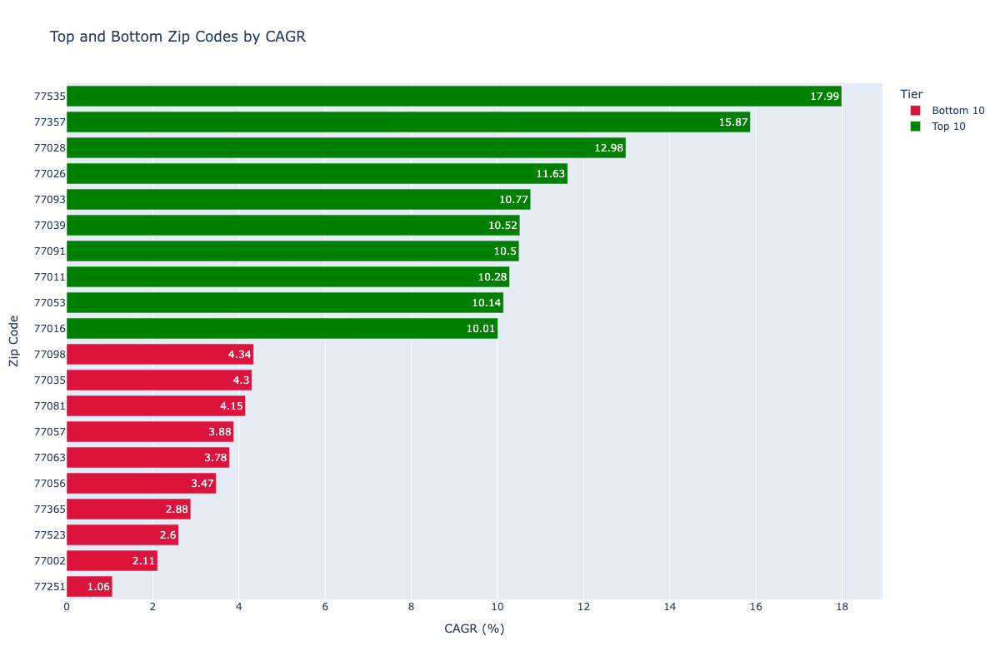

# Houston Neighborhood Appreciation Tracker


---

## Overview

This project analyzes residential property value trends across Harris County 
zip codes using HCAD appraisal data from 2022–2025.

---

## Problem Statement

Which zip codes in Harris County have seen the most and least residential 
property value growth between 2022 and 2025?

---

## Data Sources

- Harris Central Appraisal District (HCAD)
- Zillow Research 

---

## Tools & Technologies


---

## Methodology

1. **Data Collection** — Downloaded Harris County Appraisal District (HCAD) 
   residential property records for 2022–2025, totaling ~6.2 million rows 
   across 4 years. Filtered to single-family residential properties 
   (state_class = A1) resulting in ~4.5 million records.

2. **Database Setup** — Loaded cleaned data into a local SQLite database 
   using pandas and SQLAlchemy, keeping only the 9 columns relevant to 
   the analysis.

3. **Average Value by Zip** — Calculated average appraised value per zip 
   code per year using GROUP BY aggregation, filtering out properties 
   valued under $1,000.

4. **Year-Over-Year Change** — Applied the LAG() window function partitioned 
   by zip code to calculate year-over-year percentage change in average 
   value for each zip.

5. **3-Year CAGR** — Used conditional aggregation (CASE WHEN) to pivot 
   2022 and 2025 values onto the same row, then applied the CAGR formula 
   `(end/start)^(1/3) - 1` to calculate compound annual growth rate per zip.

6. **Rankings** — Used RANK() window function to identify the top 10 and 
   bottom 10 zip codes by CAGR, labeled with a tier column for visualization.

---

## Key Findings



The top 10 zip codes by 3-year CAGR are concentrated in historically 
undervalued east and northeast Houston neighborhoods (77026, 77028, 
77039, 77093) suggesting rapid appreciation driven by gentrification 
pressure moving outward from the urban core. The bottom 10 are mostly 
already high-value established areas like the Galleria (77056) and 
Montrose (77098) where percentage growth is slower despite strong 
absolute values.

---

## How to Run

### Option 1 — Local Setup (Jupyter / VS Code)

1. Clone the repository 


```
   git clone https://github.com/Mojo-TR/neighborhood-appreciation-tracker.git
   cd neighborhood-appreciation-tracker
```


2. Create and activate a virtual environment

```python
   python3 -m venv .venv
   source .venv/bin/activate  # Mac/Linux
   .venv\Scripts\activate     # Windows
```
3. Install dependencies

```
   pip install -r requirements.txt
```

4. Download the raw data files (not included in repo due to file size)
   - HCAD property data (2022–2025): [hcad.org/hcad-online-services/pdata](https://hcad.org/hcad-online-services/pdata/)
   - Zillow ZHVI zip-level CSV: [zillow.com/research/data](https://www.zillow.com/research/data/)
   - Place files in the `/data` folder

5. Launch Jupyter and run the notebook

Open `main.ipynb` and run all cells in order.

---

### Option 2 — Google Colab

1. Open the notebook directly in Colab by clicking the badge below
   [](https://colab.research.google.com/github/Mojo-TR/neighborhood-appreciation-tracker/blob/main/01_data_audit.ipynb)

2. Run the first cell to install dependencies
```python
   !pip install pandas plotly sqlalchemy kaleido
```

3. Upload the HCAD and Zillow data files when prompted, or mount 
   your Google Drive if you have them stored there
```python
   from google.colab import drive
   drive.mount('/content/drive')
```

4. Update the `BASE` variable in the notebook to point to your 
   file location
```python
   BASE = '/content/drive/MyDrive/your-folder/'
```

5. Run all cells in order

---

> **Note:** Raw data files are not included in this repository due to 
> GitHub's file size limits. See the Data Sources section for download links.

---

## Project Structure

```
├── data/
│   ├── zip_year_avg_values.csv
│   ├── yoy_appreciation.csv
│   ├── cagr_by_zip.csv
│   └── top_bottom_zips.csv
├── output/
│   ├── cagr_bar_chart.png
│   └── top5_value_trajectory.png
├── notebooks/
│   └── main.ipynb
├── requirements.txt
└── README.md
```